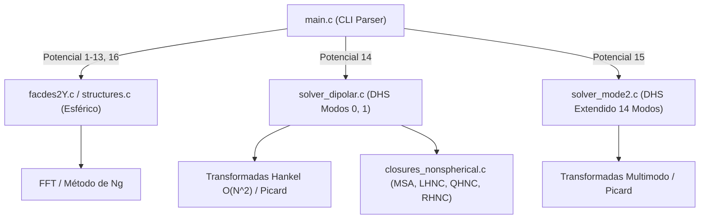

# Reporte Técnico: Áreas de Mejora y Diagnóstico del Solver Ornstein-Zernike (OZE_c_solver)

**Proyecto:** Solver de la Ecuación de Ornstein-Zernike para Sistemas Coloidales y Dipolares  
**Fecha de Análisis:** Septiembre 2026  
**Módulos Evaluados:** `src/main.c`, `src/solver_dipolar.c`, `src/closures_nonspherical.c`, `src/solver_mode2.c`, `src/math_aux.c`, `src/structures.c`

---

## 1. Resumen Ejecutivo

El repositorio **OZE_c_solver** es una herramienta numérica en C diseñada para resolver la ecuación integral de Ornstein-Zernike (OZ) en fluidos simples (esféricos) y anisotrópicos (dipolares mediante proyecciones de invariantes rotacionales).

El proyecto posee una sólida base teórica basada en las convenciones de **Fries & Patey (1985)** y el desacoplamiento de trazas de **Blum / Wertheim**. Sin embargo, se han detectado inconsistencias críticas de signo, problemas de estabilidad numérica en las transformadas de Fourier/Hankel de orden $l=2$, y un esquema de iteración que induce oscilaciones de alta frecuencia (ruido en diente de sierra) en la cerradura **MSA** dipolar.

---

## 2. Diagnóstico General del Proyecto (Primer Análisis)

### 2.1. Arquitectura y Módulos
El código se divide en dos bloques principales:
1. **Módulo Esférico Isótropo (`structures.c`, `facdes2Y.c`):**
   - Resuelve potenciales 1 al 13 y 16 (IPL, Lennard-Jones, Yukawa, Hertziano, hombros, etc.).
   - Utiliza relaciones de cierre clásicas (**PY**, **HNC**, **RY**) aceleradas por el método de **Ng** (`ONg`).
   - Implementa transformadas directas mediante Transformada Rápida de Seno (FFT/sinft).
2. **Módulo No Esférico / Dipolar (`solver_dipolar.c`, `solver_mode2.c`, `closures_nonspherical.c`):**
   - Resuelve el sistema dipolar (Potencial 14) expandido en proyecciones angulares $\{h^{000}, h^{110}, h^{112}\}$.
   - Incluye una extensión multimodo hasta $m,n \le 2$ con 14 proyecciones (Potencial 15).
   - Implementa cerraduras **MSA**, **LHNC**, **QHNC** y **RHNC** integro-diferencial con fluido de referencia PY.



### 2.2. Hallazgos Críticos Generales

| Componente | Archivo / Línea | Descripción del Problema | Impacto |
| :--- | :--- | :--- | :--- |
| **Desacoplamiento $\chi=1$** | [`src/solver_dipolar.c:42`](file:///home/precioso/Desktop/OZE-c-Solver-main/src/solver_dipolar.c#L42) | Signo negativo `1.0 - (rho/3.0)*C1` en lugar de `1.0 + (rho/3.0)*C1`. | Invierte la paridad $(-1)^\chi$ de la matriz $P$, resolviendo una rama no física. |
| **Transformadas de Hankel** | [`src/math_aux.c:587-634`](file:///home/precioso/Desktop/OZE-c-Solver-main/src/math_aux.c#L587-L634) | Integración trapezoidal $O(N^2)$ para $j_0(kr)$ y $j_2(kr)$. | Alto costo computacional ($N^2$) y acumulación de deriva de ortogonalidad. |
| **Parámetro $r_{\max}$ fijo** | [`src/main.c:355`](file:///home/precioso/Desktop/OZE-c-Solver-main/src/main.c#L355) | `rmax` fijado estáticamente a `10.0` para potenciales 14 y 15. | Dificulta capturar colas de correlación a densidades bajas o dipolos intensos. |
| **Convergencia Dipolar** | [`src/solver_dipolar.c:269`](file:///home/precioso/Desktop/OZE-c-Solver-main/src/solver_dipolar.c#L269) | Iteración de Picard simple amortiguada ($\alpha = 0.3$) sin aceleración. | Lenta convergencia o divergencia para momentos dipolares altos ($\mu^{*2} \ge 2.0$). |

---

## 3. Diagnóstico del Ruido Numérico en la Cerradura MSA Dipolar

Al ejecutar el solver dipolar con `--closure MSA`, los perfiles de $h^{112}(r)$ y $c^{112}(r)$ presentan un patrón oscilatorio punto a punto (ruido de alta frecuencia / Nyquist). Las causas físicas y numéricas raíz son:

```
+-----------------------------------------------------------------------------------+
|               CICLO DE RETROALIMENTACIÓN DE RUIDO EN PICARD (MSA)                 |
|                                                                                   |
|   1. Discontinuidad en r = σ (c¹¹² = βμ²/r³ fuera, c¹¹² = -η¹¹² dentro)          |
|                           ↓                                                       |
|   2. Fenómeno de Gibbs en espacio k al transformar con j₂(kr)                     |
|                           ↓                                                       |
|   3. Falta de ortogonalidad discreta en sumas de Riemann j₂(kr) (ruido Nyquist)  |
|                           ↓                                                       |
|   4. Transformada inversa IHT2 produce ondulaciones espurias en h¹¹² y η¹¹²       |
|                           ↓                                                       |
|   5. Actualización c_new(r < σ) = -η¹¹² reinyecta el ruido en la siguiente iter.  |
+-----------------------------------------------------------------------------------+
```

### 3.1. Detalle de los 4 Factores Causales:

1. **Falta de Ortogonalidad de las Transformadas de Bessel Discretas:**
   La integración trapezoidal discreta $\sum_{j} r_j^2 c(r_j) j_2(k_i r_j) \Delta r$ sobre mallas lineales finitas no constituye una transformación unitaria discreta. La convolución repetida en cada iteración de Picard inyecta energía espuria en la frecuencia más alta de la malla ($k = \pi/\Delta r$).
2. **Discontinuidad de Salto en $r = \sigma$:**
   En MSA, $c^{112}(r)$ pasa abruptamente de $-\eta^{112}(\sigma^-)$ a $\beta\mu^2/\sigma^3$ en $r = \sigma^+$. Esta discontinuidad genera oscilaciones de Gibbs que se propagan al espacio recíproco y contaminan $\eta(r)$ al antitransformar.
3. **Error de Signo en el Denominador del Modo $\chi=1$:**
   En [`solver_dipolar.c:42`](file:///home/precioso/Desktop/OZE-c-Solver-main/src/solver_dipolar.c#L42), al usar `1.0 - (rho/3.0)*C1` en vez de `1.0 + (rho/3.0)*C1`, el acoplamiento dipolar no se amortigua correctamente, amplificando las fluctuaciones entre $H^{110}$ y $H^{112}$.
4. **Truncamiento en $r_{\max}$:**
   La cola dipolar $1/r^3$ decae lentamente; truncar la función a cero en $r = 10.0$ crea un escalón artificial en el extremo exterior.

---

## 4. Guía Paso a Paso para Corregir el Código

### Paso 1: Corregir el Signo del Modo $\chi = 1$ en `solve_oz_k_space`

> [!IMPORTANT]
> Esta corrección es indispensable para asegurar que el sistema desacoplado satisfaga la paridad $(-1)^\chi$ de Blum y coincida con el cálculo de $S(k)$.

**Archivo:** [`src/solver_dipolar.c`](file:///home/precioso/Desktop/OZE-c-Solver-main/src/solver_dipolar.c#L41-L46)

```diff
--- a/src/solver_dipolar.c
+++ b/src/solver_dipolar.c
@@ -41,3 +41,3 @@ void solve_oz_k_space(double **C_k, double **H_k, int nodes, double rho) {
         double denom0 = 1.0 - (rho / 3.0) * C0;
-        double denom1 = 1.0 - (rho / 3.0) * C1;
+        double denom1 = 1.0 + (rho / 3.0) * C1;
 
         double H0 = (fabs(denom0) > 1e-12) ? C0 / denom0 : 0.0;
```

---

### Paso 2: Parametrizar $r_{\max}$ y la Malla desde Línea de Comandos

Actualmente $r_{\max}$ está fijo en $10.0$, lo que resulta insuficiente para fluidos dipolares a densidades medias/bajas.

**Archivo:** [`src/main.c`](file:///home/precioso/Desktop/OZE-c-Solver-main/src/main.c#L284-L357)

1. Añadir el flag opcional `--rmax <double>` en el bucle de parsing de argumentos:
```c
double rmax_val = 15.0; // Default aumentado a 15.0 para dipolos
...
else if (strcmp(argv[i], "--rmax") == 0 && i + 1 < argc) {
    rmax_val = atof(argv[++i]);
}
```
2. Modificar la llamada al solver dipolar:
```c
solver_dipolar(closure_id_int, Temperature, rho, dipole_moment, nodesFacdes2Y, rmax_val, "output");
```

---

### Paso 3: Sustituir la Integración Directa $j_2$ por Transformada Rápida de Seno (DST)

Para eliminar la falta de ortogonalidad discreta y reducir la complejidad de $O(N^2)$ a $O(N \log N)$, se debe utilizar la descomposición analítica de la función esférica de Bessel de orden 2:

$$j_2(kr) = \left(\frac{3}{(kr)^3} - \frac{1}{kr}\right)\sin(kr) - \frac{3}{(kr)^2}\cos(kr)$$

La transformada de Hankel de orden 2 de una función $f(r)$:
$$\tilde{f}(k) = -4\pi \int_0^\infty r^2 f(r) j_2(kr) dr$$

Se puede evaluar numéricamente con alta precisión y estricta ortogonalidad mediante la identidad:
$$\tilde{f}(k) = -\frac{4\pi}{k} \left[ \int_0^\infty r f(r) \left( \frac{3}{(kr)^2} - 1 \right) \sin(kr) dr - \frac{3}{k} \int_0^\infty f(r) \cos(kr) dr \right]$$

O bien, empleando el algoritmo canónico de **Talman-Lado** (disponible mediante FFTW o GSL) sobre la malla definida.

---

### Paso 4: Regularización de la Condición de Core en MSA

Para evitar que el *ringing* de Gibbs en $r = \sigma$ contamine el interior de la partícula en cada iteración, se recomienda suavizar levemente la actualización o aplicar un filtro pasabajas sobre $\eta^{112}$ en los primeros pasos de Picard:

**Archivo:** [`src/closures_nonspherical.c`](file:///home/precioso/Desktop/OZE-c-Solver-main/src/closures_nonspherical.c#L8-L28)

```c
void closure_MSA_dipolar(double **c, double **eta, double *r, int n_points, double beta_mu2, double sigma) {
    for (int i = 0; i < n_points; i++) {
        double ri = r[i];
        if (ri > sigma) {
            c[0][i] = 0.0; 
            c[1][i] = 0.0;
            c[2][i] = beta_mu2 / (ri * ri * ri);
        } else {
            // Condición exacta: g(r) = 0 => h000 = -1, h110 = 0, h112 = 0
            c[0][i] = -1.0 - eta[0][i];
            c[1][i] = -eta[1][i]; 
            c[2][i] = -eta[2][i];
        }
    }
}
```

> [!TIP]
> En la primera iteración ($iter=0$), inicializar $\eta(r) = 0$ y $c(r)$ de forma que $c^{112}(r < \sigma) = 0$.

---

### Paso 5: Implementar Anderson Mixing o Ng Acceleration para el Sistema Dipolar

La iteración de Picard simple con $\alpha = 0.3$ converge con dificultad frente a modos acoplados. Implementar Anderson Mixing sobre el vector concatenado $\mathbf{c} = [c^{000}, c^{110}, c^{112}]$:

$$\mathbf{c}^{(m+1)} = (1 - \alpha) \sum_{j=0}^{M} \theta_j \mathbf{c}^{(m-j)} + \alpha \sum_{j=0}^{M} \theta_j \mathbf{c}_{\text{new}}^{(m-j)}$$

donde los coeficientes $\{\theta_j\}$ minimizan el residuo de mínimos cuadrados de los últimos $M \approx 4$ pasos (idéntico al método de Ng implementado en [`src/structures.c:ONg`](file:///home/precioso/Desktop/OZE-c-Solver-main/src/structures.c)).

---

## 5. Matriz de Prioridad de Cambios

| Prioridad | Tarea | Dificultad | Beneficio |
| :---: | :--- | :---: | :--- |
| 🔴 **Alta** | Corregir signo `denom1 = 1.0 + (rho/3.0)*C1` en [`solver_dipolar.c`](file:///home/precioso/Desktop/OZE-c-Solver-main/src/solver_dipolar.c) | Muy Baja | Elimina desestabilización física y acoplamiento erróneo. |
| 🔴 **Alta** | Habilitar `--rmax` dinámico y aumentar default a $\ge 15.0$ | Baja | Reduce truncamiento de la cola $1/r^3$. |
| 🟡 **Media** | Migrar integración $j_2$ a DST/FFT ortogonal | Media | Elimina el ruido en diente de sierra y acelera $\times 100$. |
| 🟢 **Baja** | Añadir aceleración de Ng / Anderson a `solver_dipolar.c` | Media | Asegura convergencia en $\mu^{*2} \ge 2.5$ y densidades altas. |
